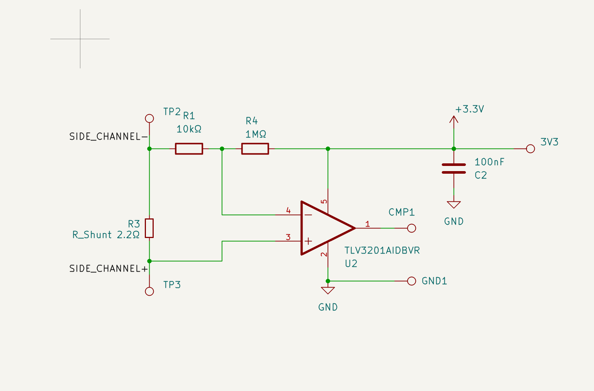
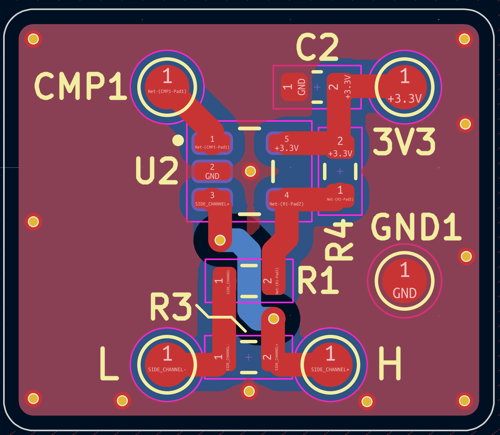
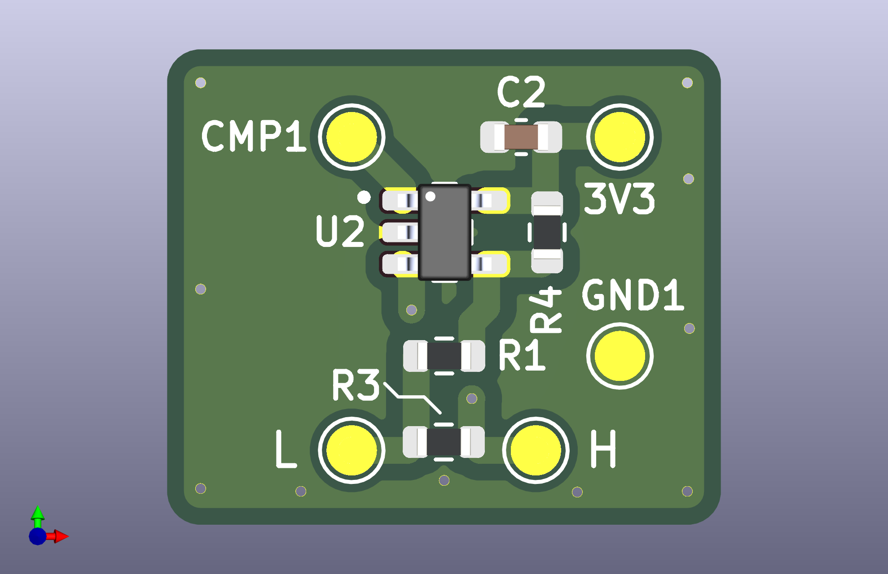

---

# Xbox One Bliss Hack Efuse Side-Channel Current Monitor (TLV3201)

# *THIS IS COMPLETELY UNTESTED AND WAS CREATED WITH LOADS OF HELP USE AS A REFERENCE ONLY*

## Hardware

### Schematic

### PCB Layout

### PCB Render

This project implements a small analog front-end designed to detect short current spikes on a low-voltage rail and convert them into a clean digital timing signal suitable for capture by a microcontroller.

The circuit measures current through a shunt resistor, and feeds the signal into a high-speed comparator that generates a logic pulse.

The digital output can be captured by a microcontroller (for example a **Teensy**) for precise timing measurements.

# Credits

The PCB layout was created by another contributor.

This repository contains the schematic, design files, and documentation for the circuit.

---

